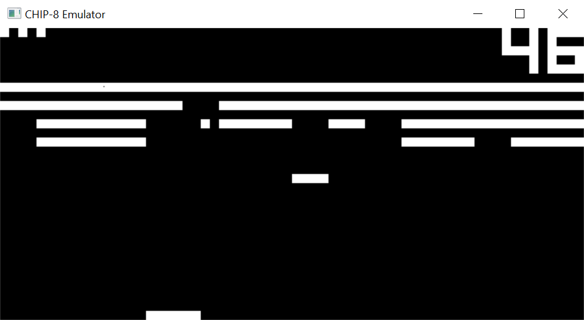
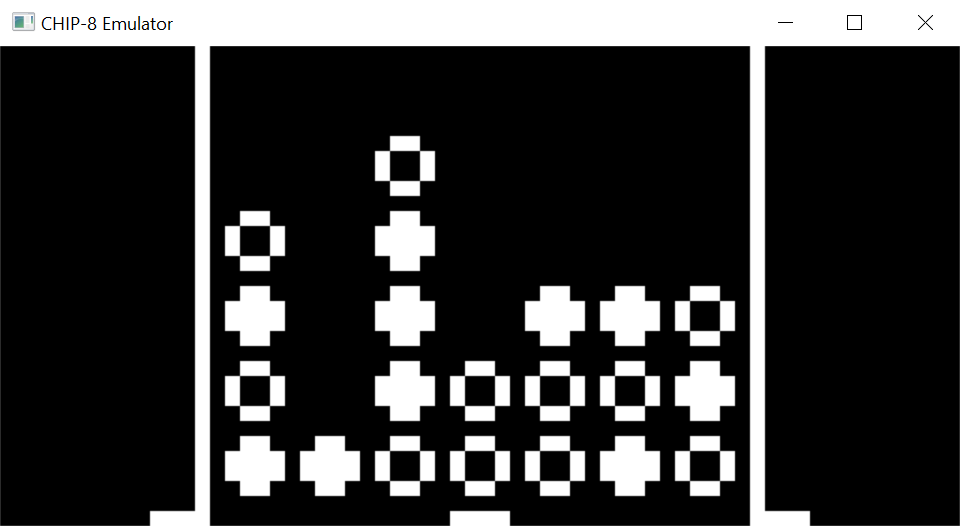
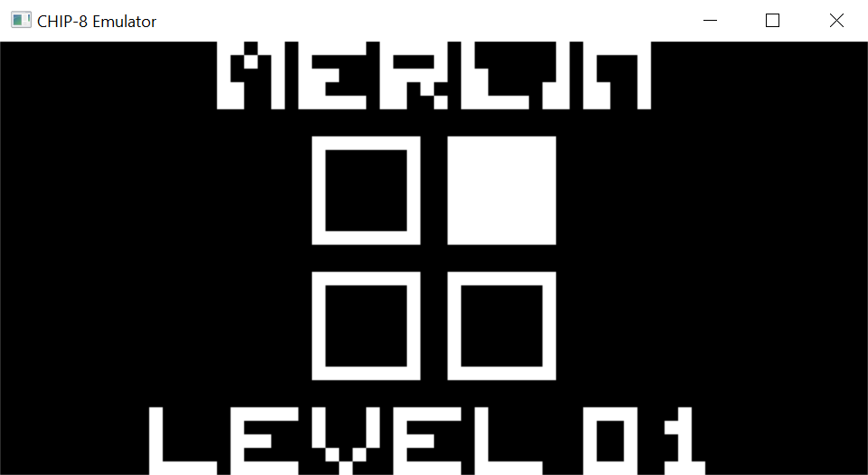
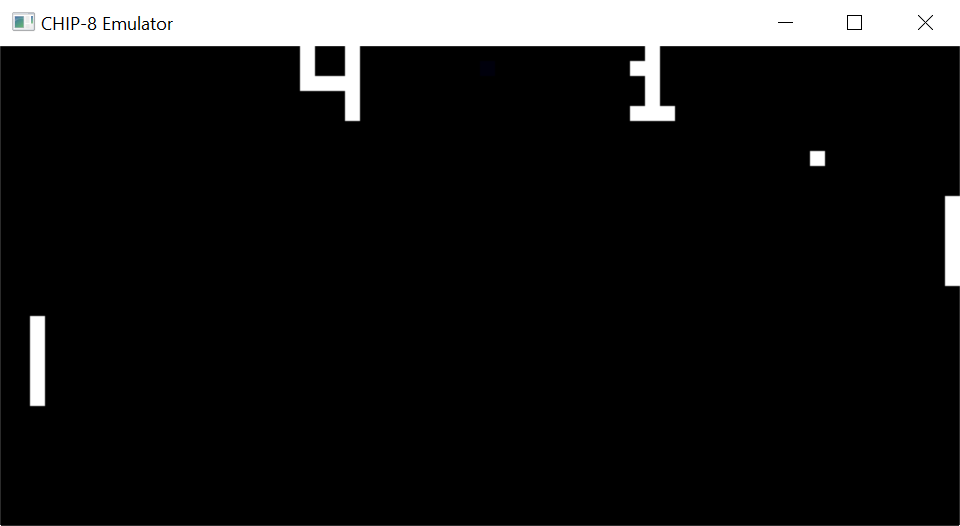
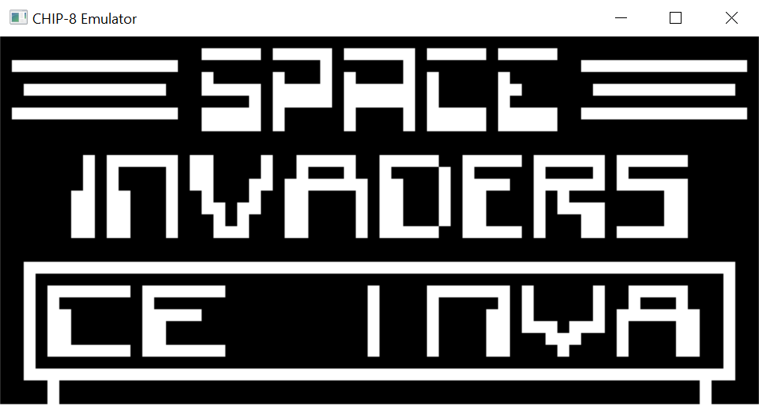
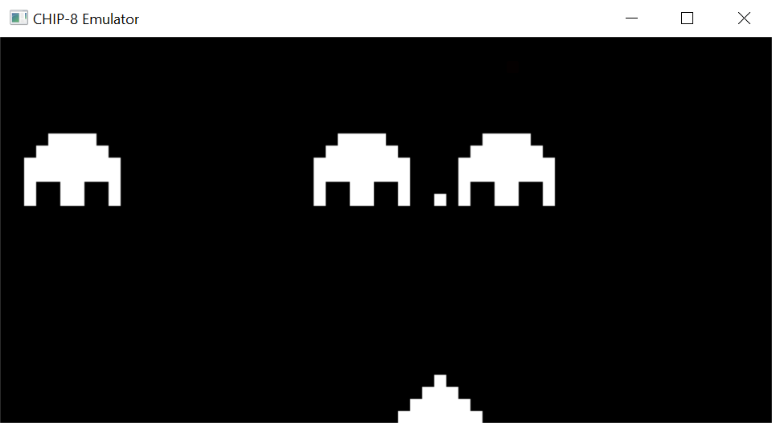
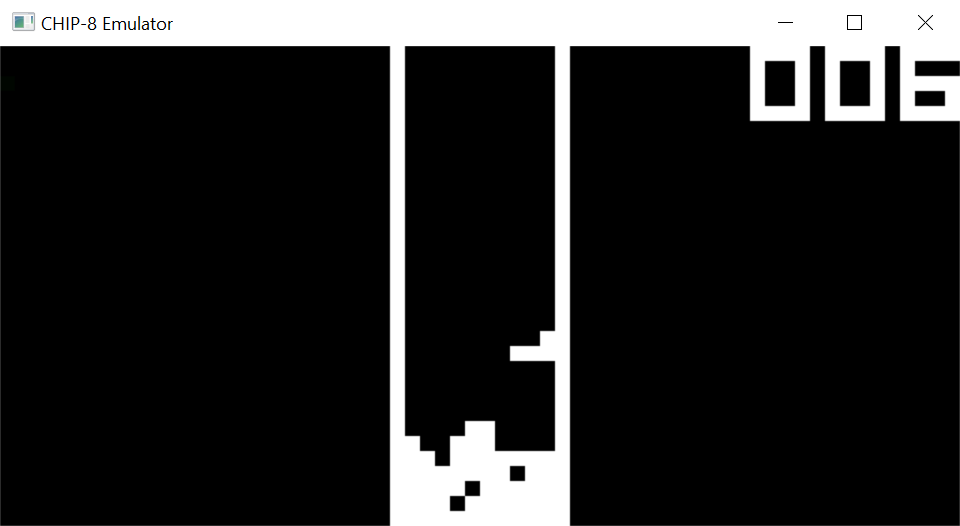
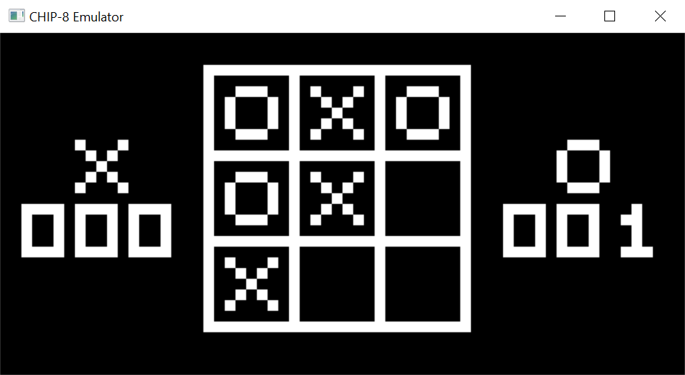

# CHIP-8-Emulator
This is a CHIP 8 Emulator written in C using SDL2. The main goal of this project was to learn the basics of how an emulator works 
and to gain an understanding of the underlying principles. It is not yet fully functional and still has some bugs but many games 
are playable. Sound and accurate timing have not yet been implemented.

## Compiling
Run the batch file `compile.bat` to compile the code on Windows.

## Running
The program expects the game ROM filename to be passed as an argument. To run the game stored in `game.rom` on Windows, run the command `.\main.exe game.rom` in Command Prompt.

## Keypad
Computers which originally used CHIP-8 had a 16-key keypad laid out as follows:  
*1 2 3 C*  
*4 5 6 D*  
*7 8 9 E*  
*A 0 B F*  
  
This layout has been mapped using the left hand side of a QWERTY keyboard, with the following positions:  
*1 2 3 4*  
*Q W E R*  
*A S D F*  
*Z X C V*
  
## Screenshots
### Breakout

### Connect 4

### Merlin

### Pong

### Space Invaders
 &nbsp;&nbsp;&nbsp; 

### Tetris

### Tic Tac Toe

## Acknowledgements
[Cowgod's Chip-8 Technical Reference](http://devernay.free.fr/hacks/chip8/C8TECH10.HTM)
